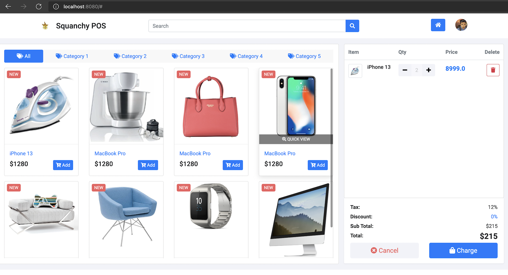

# WebPOS

## Design based on MVC

The template code divides the whole program into three parts, which makes it easy to replace the user interface with WebPos. I don't need to worry about such replacement will have considerable affect on business and database logic and implementation. Although service of POS service still needs to be revised according to the specific application in WebPOS. 

Using "inspect element" in web browser, I can easily locate the buttons that should have actions behind them. I can implement those action with business layer and database layer independently. Then I can bind those actions with specific buttons using thymeleaf.

But the actions invoked by thymeleaf template usually rely on side effects to be functional as I wish. Because they have a model string as a return value, it is hard to get value from those actions. Therefore, using value from model directly will be a better choice.

MVC isolates logic and interface, which makes coding easier without worrying complicated interaction between them. Thanks to thymeleaf template, I can also get rid of html grammer to get a beautiful web page.

## Little Problems I Came Across

### Annoying html grammer

There are so many ways of using tag in html file. So it's really annoying when I want to create a new page "paid" without template. Through such struggle, I realized how convenient templates are.

### ConcurrentModificationException

When I wanna remove a java object from a list, I came across such problem. Using "for Item item:items" and use "items.remove" will cause such problem.

The reason is that "for" will use iterator, which modify "expectedModCount" in iterator itself when removing an object. However, "remove" method will modify "modCount" in abstract data structure ArrayList. When expectedModCount and modCount are not equal, such exception is thrown.

To avoid such error, I switch iterator to remove the object.

I found relevant explanation [here](https://blog.csdn.net/qq_35056292/article/details/79751233).

## Original Requirements

The demo shows a simple POS system in MVC architecture, which replaces the shell interface in aw02 with a pos web ui (https://github.com/bshbsh404/simple-pos-ui
).



To run

```shell
mvn clean spring-boot:run
```

Currently, it just lists the products for sale with a cart with one item (just for demonstration). 

Please read the tutorial at  https://www.baeldung.com/spring-boot-crud-thymeleaf and make the POS system robust and fully functional. You can also refer to other articles, for instance https://www.baeldung.com/tag/thymeleaf/ .


And please elaborate your understanding in MVC architecture via this homework in your README.md.

